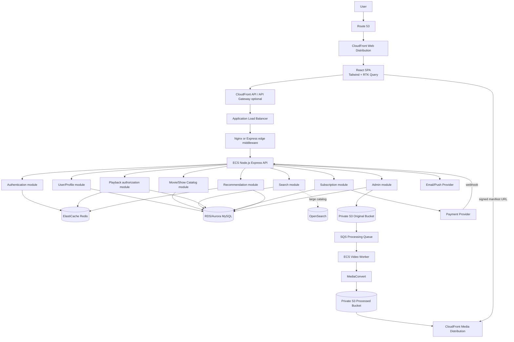
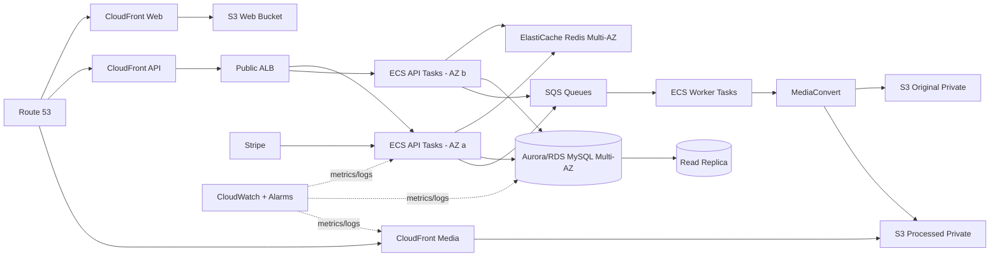
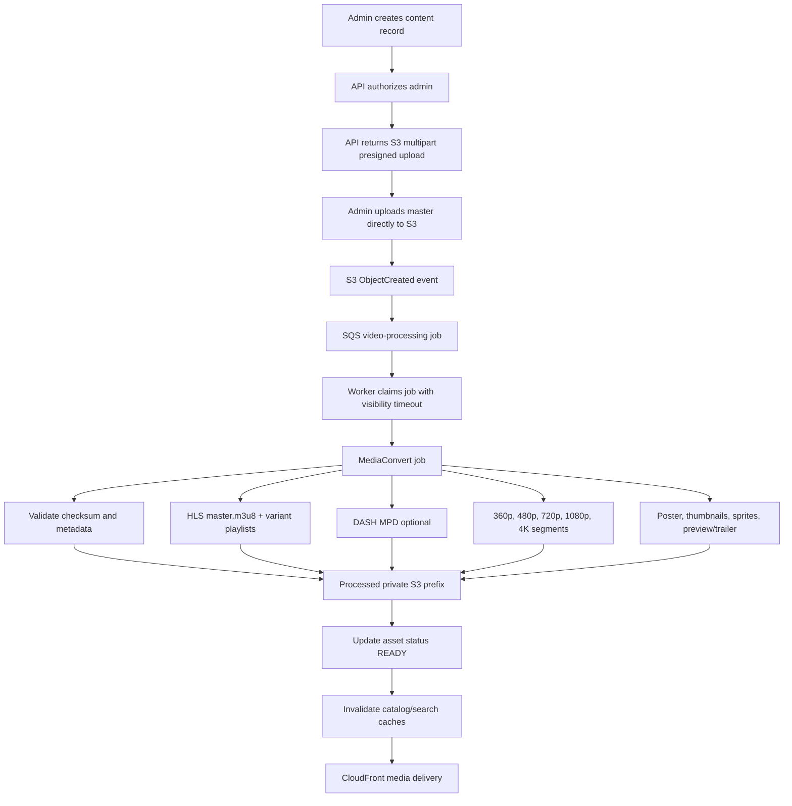
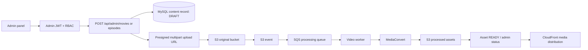
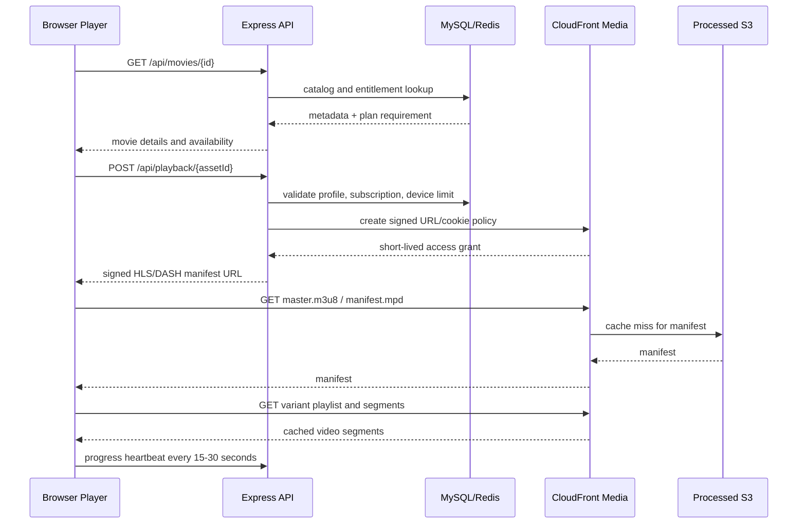
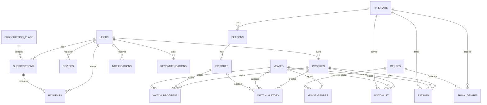
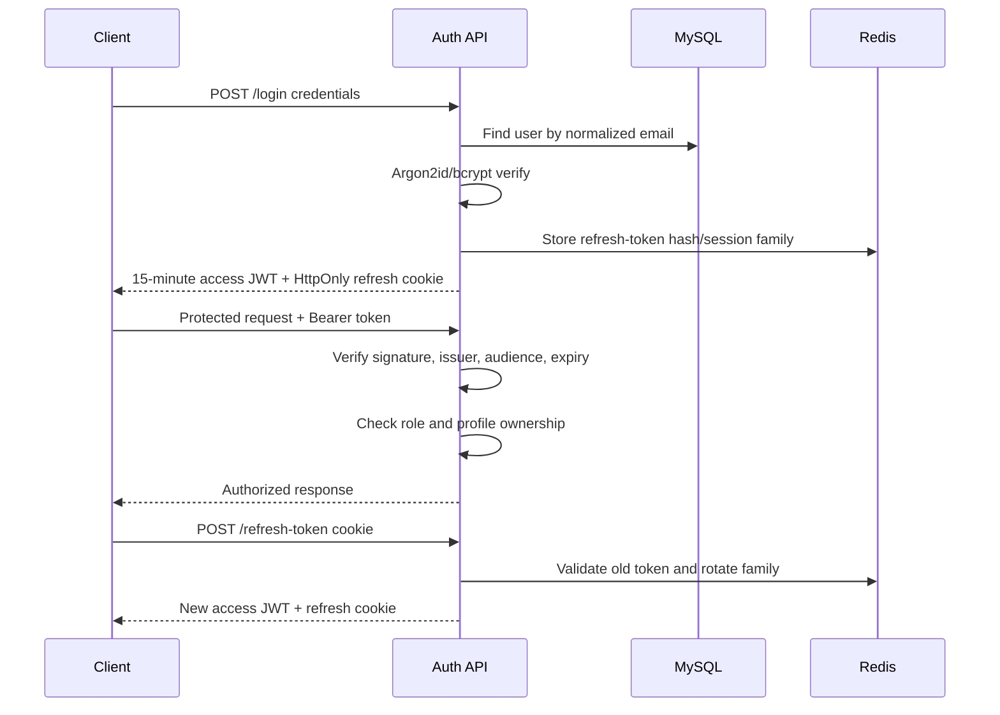
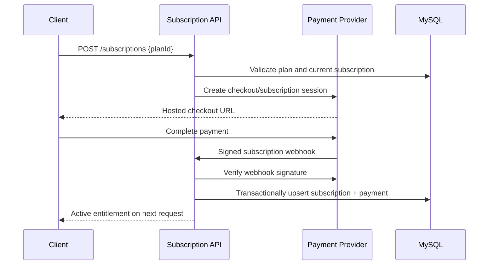
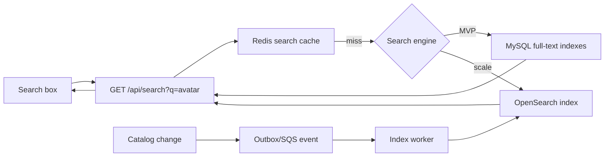

# Netflix-Like Video Streaming Platform

Production-level system design for a video-on-demand platform supporting movies, TV shows, trailers, profiles, subscriptions, adaptive streaming, search, recommendations, and an administration workflow.

## 1. Architecture Decisions

| Area                | Decision                                                      | Reason                                                                |
| ------------------- | ------------------------------------------------------------- | --------------------------------------------------------------------- |
| Frontend            | React.js, JavaScript, Tailwind CSS, Redux Toolkit + RTK Query | Component UI, predictable client state, cached API queries            |
| Backend             | Node.js + Express.js, REST, OpenAPI                           | Familiar service boundary and broad ecosystem                         |
| Primary database    | MySQL on Amazon RDS/Aurora MySQL                              | Transactions, foreign keys, billing consistency, reporting            |
| Cache/session store | Redis/ElastiCache                                             | Low-latency cache, refresh-token sessions, rate limiting              |
| Search              | MySQL full-text for MVP; Amazon OpenSearch at scale           | Start simply and graduate when search volume/content fields demand it |
| Original media      | Private S3 bucket                                             | Durable source of truth for uploaded masters                          |
| Transcoding         | AWS MediaConvert, invoked asynchronously                      | ABR renditions, HLS/DASH packaging, thumbnails                        |
| Delivery            | CloudFront signed URLs/cookies                                | Global edge delivery without exposing S3                              |
| Compute             | ECS Fargate behind an Application Load Balancer               | Horizontal scaling and reduced server operations                      |
| Async jobs          | SQS + worker service                                          | Decouples uploads, billing webhooks, indexing, and recommendations    |
| Payments            | Stripe or an equivalent PCI-compliant provider                | Do not store raw card data                                            |

The first release is a modular monolith with separate worker processes. The service boundaries below are code modules and deployment boundaries that can become independently deployed services later.

## 2. System Architecture



### Communication rules

- Browser-to-API uses HTTPS REST with JSON and short-lived access tokens.
- Browser-to-video uses HTTPS directly against the media CloudFront distribution; the API never proxies video bytes.
- API-to-MySQL uses a connection pool and parameterized queries.
- API-to-Redis is used for cache-aside reads, sessions, rate limits, and short-lived playback grants.
- S3 events or an explicit upload-complete command enqueue an idempotent SQS job.
- Payment status is finalized from signed provider webhooks, not from a browser redirect.

## 3. AWS Deployment Architecture



**Network layout:** public subnets contain ALB and NAT gateways; ECS tasks, RDS, Redis, and workers are in private subnets across at least two Availability Zones. S3 and SQS use VPC endpoints where practical. Security groups allow only ALB-to-ECS, ECS-to-RDS/Redis, and worker-to-required AWS services.

## 4. Video Upload and Processing



### Processing rules

1. The API creates a `video_asset` record with `UPLOADING` state and returns a short-lived multipart presigned URL. The browser uploads directly to S3.
2. S3 emits an event containing the object key and asset ID. The worker verifies the event, deduplicates by job ID, and submits a MediaConvert job.
3. MediaConvert creates an ABR ladder: 360p, 480p, 720p, 1080p, and 4K when the source resolution and entitlement allow it. Each rendition has a bitrate, codec, frame-rate, and audio profile appropriate for the source.
4. The worker stores output keys, duration, dimensions, and MediaConvert job ID, then marks the asset `READY`. Failures use exponential retry and eventually `FAILED` plus an admin alert.
5. Trailers can be separate assets with a public-to-subscribers entitlement policy, but remain in the private bucket.

### Why Node.js must not stream video

Streaming through Node.js consumes application CPU, memory, sockets, and bandwidth for long-lived connections, bypasses edge caching, makes range requests expensive, and couples video availability to API capacity. S3 plus CloudFront provides origin durability, byte-range delivery, TLS termination, geographic caching, connection scaling, and lower cost. Node.js only authenticates the viewer and issues a short-lived signed manifest/cookie.

### Admin video upload flow



The admin UI shows upload progress from the multipart client, then polls an asset-status endpoint. The content remains unpublished until required metadata, poster, and a ready playback asset are present; publishing is a separate RBAC-protected action.

## 5. Playback and Adaptive Bitrate Flow



The player downloads the master manifest, which lists available variants. It estimates throughput, buffer health, device capabilities, and decoder support. It chooses a rendition, then switches at a segment boundary when conditions change; the content timeline remains continuous. A 4K-capable device on a fast connection can move upward, while congestion causes a switch to 1080p, 720p, 480p, or 360p without restarting playback.

Playback authorization checks:

- profile/account is active;
- title is published and its asset is `READY`;
- subscription is active and the plan includes the title, quality, and device type;
- concurrent stream and registered-device limits are respected;
- the request is rate-limited and the asset is not revoked.

## 6. Database ER Diagram



### Relational schema

All tables have `created_at TIMESTAMP` and mutable tables have `updated_at TIMESTAMP` unless stated otherwise. IDs are `BIGINT UNSIGNED` or UUIDs; UUIDs are preferable when identifiers are exposed publicly. The examples use `CHAR(36)` UUIDs.

#### Identity and access

| Table           | Columns and constraints                                                                                                                                                                       | Indexes                                         |
| --------------- | --------------------------------------------------------------------------------------------------------------------------------------------------------------------------------------------- | ----------------------------------------------- |
| `users`         | `id PK`; `email VARCHAR(320) UNIQUE NOT NULL`; `password_hash VARCHAR(255)`; `role ENUM('USER','ADMIN')`; `status ENUM('ACTIVE','SUSPENDED','DELETED')`; `email_verified_at`; `last_login_at` | unique email, status                            |
| `profiles`      | `id PK`; `user_id FK users.id NOT NULL`; `name VARCHAR(80)`; `avatar_url`; `is_kids BOOLEAN`; `pin_hash`; `language`; `maturity_level`; `is_default`                                          | `(user_id, name) UNIQUE`, user_id               |
| `devices`       | `id PK`; `user_id FK`; `device_fingerprint`; `name`; `type`; `last_seen_at`; `revoked_at`                                                                                                     | `(user_id, device_fingerprint) UNIQUE`, user_id |
| `notifications` | `id PK`; `user_id FK`; `type`; `title`; `body`; `read_at`; `payload JSON`                                                                                                                     | `(user_id, read_at, created_at)`                |

#### Catalog and media

| Table          | Columns and constraints                                                                                                                                                                                                                                                  | Indexes                                                            |
| -------------- | ------------------------------------------------------------------------------------------------------------------------------------------------------------------------------------------------------------------------------------------------------------------------ | ------------------------------------------------------------------ |
| `movies`       | `id PK`; `title`; `slug UNIQUE`; `synopsis TEXT`; `release_date`; `duration_seconds`; `age_rating`; `poster_key`; `backdrop_key`; `trailer_asset_id`; `video_asset_id`; `status ENUM('DRAFT','PROCESSING','PUBLISHED','ARCHIVED')`; `is_premium`; `search_document TEXT` | slug, status, release_date, full-text title/synopsis               |
| `tv_shows`     | `id PK`; `title`; `slug UNIQUE`; `synopsis`; `release_date`; `poster_key`; `backdrop_key`; `status`; `is_premium`; `search_document`                                                                                                                                     | slug, status, full-text                                            |
| `seasons`      | `id PK`; `show_id FK`; `season_number`; `title`; `release_date`                                                                                                                                                                                                          | `(show_id, season_number) UNIQUE`                                  |
| `episodes`     | `id PK`; `season_id FK`; `episode_number`; `title`; `synopsis`; `duration_seconds`; `release_date`; `thumbnail_key`; `video_asset_id`; `status`                                                                                                                          | `(season_id, episode_number) UNIQUE`, status                       |
| `video_assets` | `id PK`; `content_type`; `content_id`; `asset_kind ENUM('MASTER','TRAILER','PREVIEW')`; `source_key`; `manifest_key`; `dash_manifest_key`; `processing_status`; `duration_seconds`; `source_checksum`; `mediaconvert_job_id`                                             | `(content_type, content_id, asset_kind) UNIQUE`, processing status |
| `genres`       | `id PK`; `name UNIQUE`; `slug UNIQUE`                                                                                                                                                                                                                                    | slug                                                               |
| `movie_genres` | `movie_id FK`; `genre_id FK`; composite PK `(movie_id, genre_id)`                                                                                                                                                                                                        | genre_id                                                           |
| `show_genres`  | `show_id FK`; `genre_id FK`; composite PK `(show_id, genre_id)`                                                                                                                                                                                                          | genre_id                                                           |

`movies` and `tv_shows` are separate because episode hierarchy and lifecycle differ. A production implementation may add a `content` supertype later if cross-content queries become dominant.

#### Engagement

| Table             | Columns and constraints                                                                                                                                                             | Indexes                                                                       |
| ----------------- | ----------------------------------------------------------------------------------------------------------------------------------------------------------------------------------- | ----------------------------------------------------------------------------- |
| `watch_history`   | `id PK`; `profile_id FK`; nullable `movie_id FK`; nullable `episode_id FK`; `watched_at`; `completed_at`; `source`; exactly one content FK enforced in application/database trigger | `(profile_id, watched_at DESC)`, content IDs                                  |
| `watch_progress`  | `id PK`; `profile_id FK`; nullable movie/episode FK; `position_seconds`; `duration_seconds`; `percent_complete`; `last_watched_at`; `completed_at`                                  | `(profile_id, content identity) UNIQUE`, `(profile_id, last_watched_at DESC)` |
| `watchlist`       | `id PK`; `profile_id FK`; nullable movie/show FK; `added_at`                                                                                                                        | unique profile plus content identity, `(profile_id, added_at DESC)`           |
| `ratings`         | `id PK`; `profile_id FK`; nullable movie/show FK; `score TINYINT CHECK 1..5`; `rated_at`; exactly one content FK                                                                    | unique profile plus content identity, content ID                              |
| `recommendations` | `id PK`; `profile_id FK`; `content_type`; `content_id`; `score DECIMAL(8,5)`; `reason`; `model_version`; `expires_at`                                                               | `(profile_id, score DESC)`, `(profile_id, expires_at)`                        |

#### Billing

| Table                | Columns and constraints                                                                                                                                                                    | Indexes                                    |
| -------------------- | ------------------------------------------------------------------------------------------------------------------------------------------------------------------------------------------ | ------------------------------------------ |
| `subscription_plans` | `id PK`; `code UNIQUE`; `name`; `price_minor INT`; `currency CHAR(3)`; `billing_interval`; `max_quality`; `max_devices`; `features JSON`; `active`                                         | active, code                               |
| `subscriptions`      | `id PK`; `user_id FK`; `plan_id FK`; `provider_customer_id`; `provider_subscription_id UNIQUE`; `status`; `current_period_start`; `current_period_end`; `cancel_at_period_end`; `ended_at` | user/status, provider ID, period end       |
| `payments`           | `id PK`; `user_id FK`; `subscription_id FK`; `provider_payment_id UNIQUE`; `amount_minor`; `currency`; `status`; `paid_at`; `failure_code`; `receipt_url`                                  | user/created_at, subscription, provider ID |

Foreign keys use `ON DELETE RESTRICT` for billing and catalog records and soft deletion for user/content data. Engagement records can be retained for analytics under the account's retention policy.

## 7. Backend Modules and Folder Structure

```text
backend/
  src/
    app.js
    server.js
    config/                 # environment validation, AWS, database, Redis
    middleware/             # auth, RBAC, validation, rate limits, errors
    modules/
      auth/                 # register, login, refresh rotation, logout
      users/                # accounts, profiles, devices
      catalog/              # movies, shows, seasons, episodes, genres
      playback/             # entitlement and signed CloudFront grants
      watch/                # progress, history, continue watching, list
      search/               # MySQL/OpenSearch adapter
      recommendations/      # feature extraction and ranking
      subscriptions/        # plans, lifecycle, entitlements
      payments/             # provider adapter and webhooks
      admin/                # content, users, analytics
      notifications/
    jobs/                   # SQS consumers and scheduled jobs
    shared/                 # logger, errors, pagination, IDs, metrics
    routes.js
  migrations/
  tests/
  Dockerfile
  package.json
frontend/
  src/
    app/store.js
    app/api.js              # RTK Query base API
    routes/
    features/auth/
    features/catalog/
    features/search/
    features/player/
    features/watch/
    features/subscriptions/
    features/profile/
    features/admin/
    components/
    styles/
  public/
  package.json
infra/
  terraform/                # VPC, ECS, ALB, RDS, Redis, S3, CloudFront, SQS
  environments/
docs/
  architecture.md
```

## 8. REST API Design

All protected endpoints require `Authorization: Bearer <access_token>`. Responses use `{ data, meta, error }`. List endpoints support `page`, `limit`, `sort`, and `cursor` where appropriate.

### Public and user endpoints

| Method | Route                     | Purpose                                                      |
| ------ | ------------------------- | ------------------------------------------------------------ |
| POST   | `/api/auth/register`      | Create account and default profile                           |
| POST   | `/api/auth/login`         | Issue access token and rotated refresh token                 |
| POST   | `/api/auth/refresh-token` | Rotate refresh token                                         |
| POST   | `/api/auth/logout`        | Revoke refresh-token session                                 |
| GET    | `/api/movies`             | Browse with genre, year, rating, premium, pagination filters |
| GET    | `/api/movies/trending`    | Ranked recent engagement list                                |
| GET    | `/api/movies/popular`     | Popularity list                                              |
| GET    | `/api/movies/:id`         | Movie details, availability, related content                 |
| GET    | `/api/shows`              | Browse shows                                                 |
| GET    | `/api/shows/:id`          | Show details                                                 |
| GET    | `/api/shows/:id/seasons`  | Seasons and episode summaries                                |
| GET    | `/api/episodes/:id`       | Episode details                                              |
| GET    | `/api/search?q=avatar`    | Search movies, shows, actors, directors, genres, keywords    |
| POST   | `/api/watchlist`          | Add movie/show to current profile list                       |
| DELETE | `/api/watchlist/:id`      | Remove list item                                             |
| POST   | `/api/watch-progress`     | Upsert playback heartbeat                                    |
| GET    | `/api/continue-watching`  | Incomplete recent items                                      |
| GET    | `/api/watch-history`      | Paginated profile history                                    |
| POST   | `/api/ratings`            | Create or update rating                                      |
| GET    | `/api/recommendations`    | Cached profile recommendations                               |
| POST   | `/api/playback/:assetId`  | Validate entitlement and return signed manifest              |
| GET    | `/api/subscription-plans` | List active plans                                            |
| POST   | `/api/subscriptions`      | Create checkout/subscription session                         |
| POST   | `/api/payments`           | Start payment flow; never accept raw card data               |
| GET    | `/api/payments`           | Payment history                                              |
| PATCH  | `/api/profiles/:id`       | Manage profile                                               |

### Admin endpoints

| Method          | Route                                            | Purpose                                       |
| --------------- | ------------------------------------------------ | --------------------------------------------- |
| POST/PUT/DELETE | `/api/admin/movies`, `/api/admin/movies/:id`     | Manage movies                                 |
| POST/PUT/DELETE | `/api/admin/shows`, `/api/admin/shows/:id`       | Manage shows                                  |
| POST/PUT/DELETE | `/api/admin/seasons`, `/api/admin/seasons/:id`   | Manage seasons                                |
| POST/PUT/DELETE | `/api/admin/episodes`, `/api/admin/episodes/:id` | Manage episodes                               |
| POST            | `/api/admin/upload`                              | Create upload session/presigned multipart URL |
| GET/PATCH       | `/api/admin/users`                               | Manage users and statuses                     |
| CRUD            | `/api/admin/subscription-plans`                  | Manage plans                                  |
| CRUD            | `/api/admin/genres`                              | Manage genres/categories                      |
| GET             | `/api/admin/analytics`                           | Catalog, playback, revenue, and job metrics   |
| POST            | `/api/webhooks/payments`                         | Provider-signed subscription/payment events   |

### Example: login

```http
POST /api/auth/login
Content-Type: application/json

{"email":"sam@example.com","password":"correct horse battery staple"}
```

```json
{
  "data": {
    "user": { "id": "u_123", "email": "sam@example.com", "role": "USER" },
    "profiles": [{ "id": "p_123", "name": "Sam", "isDefault": true }],
    "accessToken": "eyJ..."
  },
  "meta": { "accessTokenExpiresIn": 900 }
}
```

The refresh token is an `HttpOnly; Secure; SameSite=Lax` cookie, not JSON or local storage.

### Example: browse and playback

```http
GET /api/movies?genre=action&sort=trending&limit=20
Authorization: Bearer eyJ...
```

```json
{
  "data": [
    {
      "id": "m_42",
      "title": "Orbit Run",
      "posterUrl": "https://media.example/...",
      "isPremium": true
    }
  ],
  "meta": { "nextCursor": "eyJ..." }
}
```

```http
POST /api/playback/asset_42
Authorization: Bearer eyJ...
Content-Type: application/json

{"profileId":"p_123","deviceId":"d_9"}
```

```json
{
  "data": {
    "manifestUrl": "https://media.example/hls/asset_42/master.m3u8?Policy=...&Signature=...",
    "expiresAt": "2026-08-19T12:15:00Z",
    "protocol": "HLS",
    "availableQualities": ["360p", "480p", "720p", "1080p", "4K"]
  }
}
```

### Example: progress

```http
POST /api/watch-progress
Authorization: Bearer eyJ...
Content-Type: application/json

{"profileId":"p_123","contentType":"EPISODE","contentId":"e_77","positionSeconds":812,"durationSeconds":2400}
```

The server validates that duration and content identity are plausible, upserts progress, and emits a low-priority analytics event. The UI sends heartbeats every 15-30 seconds and immediately on pause/page exit.

## 9. Authentication and RBAC



- Access JWT: 10-15 minutes, signed with an asymmetric key from Secrets Manager/KMS; claims include `sub`, `role`, `sessionId`, `iat`, `exp`, issuer, and audience. Keep it small and never put sensitive data in it.
- Refresh token: 30-60 days, opaque random value or JWT with a server-side hash. Store only a hash in Redis/database, bind to a session/device, rotate on every refresh, and revoke the entire family on reuse detection.
- Middleware order: request ID, HTTPS/proxy checks, Helmet, CORS allowlist, rate limit, body/schema validation, authentication, resource ownership/RBAC, handler, centralized error mapping.
- Admin routes require `role=ADMIN`, step-up authentication for destructive/billing actions, and audit events.

## 10. Subscriptions and Payments



Plans:

| Plan     | Example entitlement                                                |
| -------- | ------------------------------------------------------------------ |
| Free     | Ad-supported trailers and selected catalog; one device; up to 480p |
| Basic    | Full eligible catalog; one stream; 720p                            |
| Standard | Two concurrent streams; 1080p; downloads optional                  |
| Premium  | Four concurrent streams; 4K/HDR where available                    |

The subscription service owns plan configuration, provider customer IDs, lifecycle status, renewal dates, grace periods, cancellation, and entitlements. A webhook handler is idempotent on provider event ID. A scheduled job marks overdue subscriptions past grace period as expired and retries failed invoices according to provider policy. The watch path checks `subscriptions.status`, `current_period_end`, `plan_id`, title restrictions, quality, and active stream count. Do not trust a client-supplied plan or payment success flag.

## 11. Recommendations

```mermaid
flowchart TD
    EVENTS[Watch progress, completion, ratings, list changes] --> QUEUE[SQS analytics queue]
    QUEUE --> AGG[Feature aggregation worker]
    AGG --> FEATURES[(User genre/profile features)]
    FEATURES --> RANK[Rule-based ranker]
    CATALOG[Catalog metadata + popularity] --> RANK
    RANK --> STORE[(Recommendations table)]
    STORE --> REDIS[(Redis key rec:{profileId})]
    REDIS --> API[GET /api/recommendations]
    API --> UI[Home page rows]
```

MVP ranking: filter unavailable/already-completed titles, then blend genre affinity from watch history, recent activity, ratings, similar genres/keywords, and global popularity. Apply freshness, diversity, maturity, locale, and plan entitlement filters. Cache each profile for 15-60 minutes and invalidate after a meaningful rating/completion. Later, replace the ranker with batch collaborative filtering and then a two-stage candidate-generation/ranking model using an offline feature store and online experimentation; retain business-rule filtering after model scoring.

## 12. Search



Search fields are normalized title, alternate title, actors, director, genre, show title, episode title, keywords, locale, and popularity. Use prefix matching/autocomplete for short queries, typo tolerance in OpenSearch, and cursor pagination. Cache normalized query plus filter/sort/page with a 1-5 minute TTL. On publish/update/delete, publish an outbox event so index changes are eventually consistent; a nightly reconciliation job repairs drift.

## 13. Redis Usage and Invalidation

| Key pattern              | Contents                          |            TTL |
| ------------------------ | --------------------------------- | -------------: |
| `catalog:movie:{id}`     | Movie detail DTO                  |       5-30 min |
| `catalog:show:{id}`      | Show detail DTO                   |       5-30 min |
| `list:trending:{region}` | Ranked IDs/DTOs                   |        1-5 min |
| `list:popular:{region}`  | Ranked IDs/DTOs                   |       5-15 min |
| `rec:{profileId}`        | Recommendation DTOs               |      15-60 min |
| `search:{hash}`          | Search response                   |        1-5 min |
| `session:{sessionId}`    | Hashed refresh session state      | token lifetime |
| `rate:{ip}:{route}`      | Sliding-window counters           |  window length |
| `playback:{grantId}`     | Short-lived authorization context |        1-5 min |

Use cache-aside reads. Content mutation publishes an invalidation event for the specific detail, related list keys, and search index. Avoid deleting every key synchronously; versioned keys and short TTLs prevent stale data from becoming a correctness issue. Subscription changes invalidate entitlement and playback keys immediately. Redis is not the system of record.

## 14. Security Architecture

- TLS everywhere, HSTS, secure certificate management, and HTTP-to-HTTPS redirects.
- Argon2id preferred, bcrypt acceptable with a strong cost factor; normalize emails and never log passwords/tokens.
- Helmet, strict CORS allowlist, JSON/body size limits, schema validation with Zod/Joi, output encoding, and parameterized SQL/ORM queries. MySQL plus parameterized queries prevents SQL injection; there is no direct SQL built from user strings.
- SameSite secure cookies, CSRF tokens for cookie-authenticated state-changing browser endpoints, and origin checks. Bearer-only APIs still need careful CORS and XSS defenses.
- Per-IP, per-account, and per-device rate limits in Redis; stronger limits for login, refresh, search, playback, and upload creation.
- S3 buckets are private, block public access, encrypt with KMS, enable versioning, and permit access through least-privilege IAM roles only. CloudFront Origin Access Control is the only media origin path.
- Use CloudFront signed URLs or signed cookies with short expiry and path restrictions. Never return an S3 URL or long-lived credential to the browser.
- Store secrets in AWS Secrets Manager/Parameter Store; rotate database, JWT signing, and provider keys. Use KMS encryption at rest.
- Admin audit log should capture actor, action, resource, request ID, before/after summary, IP, and outcome. Do not log payment secrets or sensitive personal data.
- Payment provider handles card data. Verify webhook signatures and use idempotency keys for checkout and provider calls.

## 15. Scalability Plan

| Scale            | Architecture and first priorities                                                                                                                                                                                                             |
| ---------------- | --------------------------------------------------------------------------------------------------------------------------------------------------------------------------------------------------------------------------------------------- |
| 1,000 users      | One modular Express service on ECS/EC2, RDS Multi-AZ, one Redis, S3/MediaConvert/CloudFront, SQS worker. Measure before splitting services.                                                                                                   |
| 100,000 users    | 2+ API tasks behind ALB, autoscaling on CPU/request latency, Redis cache, read replica, CDN for all media and static assets, separate workers and OpenSearch if search warrants it.                                                           |
| 1 million users  | Multiple API/worker task groups, Aurora read scaling, partition high-volume watch events by time/profile, SQS buffering, regional CloudFront distribution, dedicated analytics pipeline, connection pooling/proxy.                            |
| 10 million users | Domain services can deploy independently, multi-region read strategy, global routing, regional playback authorization, event streaming/data lake, OpenSearch clusters, active/passive or active/active DR, strict capacity and cost controls. |

Scale first in this order: CloudFront/media delivery because video bytes dominate bandwidth; API tasks because stateless horizontal scaling is simple; Redis because hot catalog/read traffic is cheap to absorb; workers/SQS because processing spikes are bursty; database reads/indexes because content reads grow before transactional writes; only then split services when ownership, deployment cadence, or failure isolation demands it.

Use cursor pagination, CDN cache headers, database indexes, read replicas, batched writes, and idempotent workers before adding microservices. Never put watch-progress heartbeats on the same synchronous path as billing or catalog writes without queueing/batching.

## 16. Background Jobs

Queues:

- `video-processing`: S3 event to MediaConvert; exponential retry, DLQ, checksum/idempotency.
- `catalog-indexing`: publish changes to OpenSearch.
- `analytics-events`: watch, playback, and engagement events.
- `recommendation-refresh`: profile and global recommendation jobs.
- `notifications`: email/push delivery.
- `billing-reconciliation`: provider status reconciliation and expired subscription handling.

Workers use visibility timeouts longer than expected work, heartbeats for long jobs, a DLQ, structured job IDs, and an idempotency table. The API acknowledges upload initiation quickly; transcoding status is polled by the admin UI or delivered through notifications/websocket later.

## 17. Monitoring and Alerting

- Structured JSON logs with request ID, user/profile ID where safe, route, status, latency, and error code; centralize in CloudWatch Logs and set retention.
- Metrics: request rate, p50/p95/p99 latency, 4xx/5xx, auth failures, refresh reuse, queue depth/age, worker failure rate, MediaConvert failures, DB CPU/connections/locks/replica lag, Redis memory/evictions, ALB target health, CloudFront cache hit ratio/4xx/5xx/bytes, playback start failure, rebuffering, and CDN segment errors.
- Traces across API, Redis, RDS, SQS, and AWS SDK calls using OpenTelemetry/X-Ray-compatible tracing.
- Error tracking groups exceptions by release and route, scrubs PII, and links alerts to request IDs.
- Alert examples: 5xx > 2% for 5 minutes; p95 API latency > 500 ms for 10 minutes; queue age > 10 minutes; DB replica lag > 30 seconds; Redis evictions sustained; playback start failure > 3%; MediaConvert DLQ nonempty; CloudFront origin 5xx > 1%.
- Use warning/critical severity, on-call escalation, dashboards, and runbooks. Synthetic checks exercise login, catalog, playback authorization, and a test media manifest.

## 18. Disaster Recovery and Failure Handling

Targets should be explicit; a reasonable starting point is RPO <= 5 minutes and RTO <= 60 minutes for the catalog/billing API, with media restored from S3 rather than database backup.

- **Backend task failure:** ALB health checks remove the task; ECS replaces it. Requests are retried only for safe/idempotent operations. SQS jobs remain durable.
- **Database failure:** RDS Multi-AZ failover promotes the standby. Retry transient connection failures with bounded backoff; read replicas can serve catalog reads. Restore to a point in time if corruption occurs.
- **S3 unavailable:** CloudFront serves cached segments where possible; playback of uncached content fails gracefully with a retryable message. Keep originals and processed outputs versioned, replicate critical media cross-region, and rebuild a distribution/origin from inventory.
- **Video processing failure:** MediaConvert status event marks the asset failed, retries transient failures, sends poison jobs to DLQ, and alerts admins. The previous published asset remains available during replacement processing.
- **CloudFront issue:** API remains available; use provider status/runbook, alternate distribution/origin only if tested, and display a playback incident state. Do not expose S3 publicly as an emergency shortcut.
- **Backups:** automated RDS backups plus encrypted cross-region snapshots, tested restore drills; S3 versioning/lifecycle policies and cross-region replication for masters and critical outputs; configuration and infrastructure in version control.

## 19. MVP Versus Production

### MVP

- React SPA, RTK Query, one Express modular monolith, ECS service, RDS MySQL Multi-AZ, Redis, S3, MediaConvert, CloudFront, SQS worker, Stripe checkout, MySQL full-text search, rule-based recommendations, one AWS region.
- Movies, shows, seasons, episodes, profiles, authentication, watch progress/history, list, ratings, subscription access, admin upload/content management.
- Basic CloudWatch dashboards, backups, private buckets, signed playback grants, rate limiting, and audit events.

### Production evolution

- OpenSearch with outbox indexing, dedicated analytics/event pipeline, recommendation feature store and model ranking, multiple worker pools, service-level autoscaling, global CDN/region strategy, cross-region media replication, stronger admin step-up controls, feature flags, canary deploys, SLOs, synthetic playback tests, data retention/privacy controls, and tested DR failover.
- Extract services only around measurable bottlenecks or independent operational ownership: playback authorization, search, recommendations, media processing, and billing are the likely candidates.

## 20. Cost Considerations

The major variable cost is egress and CDN delivery, followed by storage, transcoding minutes, database capacity, OpenSearch, Redis, and NAT gateways. Optimize by:

- using CloudFront caching and correct cache headers for immutable segments;
- storing masters in S3 Standard/Intelligent-Tiering and archiving older originals where recovery requirements allow;
- generating 4K only for suitable titles and plans;
- using MediaConvert queue priorities and batching thumbnails;
- keeping API tasks stateless and right-sized with autoscaling;
- using RDS reserved capacity/read scaling instead of overprovisioning early;
- controlling log retention, NAT traffic, and OpenSearch shard count;
- measuring cost per playback hour, per active subscriber, and per transcoded title.

A production budget should be driven from expected monthly viewing hours, average delivered bitrate, storage growth, upload volume, peak concurrent streams, and regional distribution. Video egress must be modeled before launch; it will usually outweigh CRUD API compute.

## 21. Recommended Build Sequence

1. Establish Terraform networking, IAM, S3 private buckets, CloudFront OAC, RDS, Redis, ECS, SQS, and Secrets Manager.
2. Build identity, profiles, catalog schema, admin CRUD, and API observability.
3. Implement direct multipart upload, S3 events, SQS, MediaConvert, asset state machine, and signed playback.
4. Build browse/detail/player flows, progress/history/list, then subscription and webhook reconciliation.
5. Add search, ratings, recommendations, notifications, analytics dashboards, and operational runbooks.
6. Run load tests for catalog, playback authorization, progress writes, queue bursts, and concurrent CloudFront playback; complete backup restore and failover drills before broad release.
